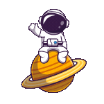

  

<h2 align="center">Hi there 👋</h2>

I'm Farras Syuja, a passionate developer who loves building creative digital experiences.

---

### 💻 I Code With

  
  
  
  
  
  
  
  
  
  
  
  
  
  
  
  
  
  
  

---

### 📈 Contribution Graph

  <picture>
    <source media="(prefers-color-scheme: dark)" srcset="https://raw.githubusercontent.com/Syujaaa/Syujaaa/output/pacman-contribution-graph-dark.svg">
    <source media="(prefers-color-scheme: light)" srcset="https://raw.githubusercontent.com/Syujaaa/Syujaaa/output/pacman-contribution-graph.svg">
    
  </picture>

---

### 🐍 Snake Animation

  

